# Mahler

A automated task composer and [HTN](https://en.wikipedia.org/wiki/Hierarchical_task_network) based planner for building autonomous system agents in typescript.

**NOTE** even though this project is on its v1, we still consider it experimental, as we continue exploring different mechanisms to improve efficiency of various aspects of the framework. This project does adhere to the [semantic versioning guidelines](https://semver.org/), so we wont perform any breaking API changes without a major version bump.

## Features

- Simple API. Define primitive tasks by declaring the `effect` it has on the system state, a `condition` for the task to be chosen, and an `action`, which is the asynchronous operation that will be performed on the system if the task is chosen for the plan. Tasks can be used by other compound tasks (or _methods_) to guide the planner towards a desired behavior.
- Highly configurable `Agent` interface allows to create autonomous agents to serve a wide variety of use cases. Create a single shot agent to just reach a specific goal, or create a service agent that keeps monitoring the state of the world and making changes as needed to keep the system on target. Agents support re-planning if the state of the system changes during the plan execution or errors occur while executing actions. This runtime context can be used as feedback to the planning stage to chose different paths if needed.
- Observable runtime. The agent runtime state and knowledge of the world can be monitored at all times with different levels of detail. Human readable metadata for tasks can be provided via the task `description` property. Plug in a logger to generate human readable logs.
- Parallel execution of tasks. The planner automatically detects when operations can be performed in parallel and creates branches in the plan to tell the agent to run branches concurrently.
- Easy to debug. Agent observable state and known goals allow easy replicability when issues occur. The planning decision tree and resulting plans can be diagrammed to visually inspect where planning is failing.

## Requirements

- Node.js 18+. Other runtimes are unsupported at this moment.

## Installation

```
npm install --save mahler
```

## Core Concepts

- **Autonomous system agent** a process on a system that needs to operate with little or not feedback from the outside world. An autonomous agent needs to be able to recover from failures and adapt if conditions on the system change while performing its duties. In our definition, such an agent operates based on a given goal and will keep trying to achieve the goal until the goal changes or some other exit conditions are met.
- **Hierarchical Task Network (HTN)** is a type of automated planning system that allows to define actions in the planning domain in a hierarchical manner, allowing actions to be re-used as part of compound tasks. This reduces the search domain and provides developers more control on what plans are preferable (over something like [STRIPS](https://es.wikipedia.org/wiki/STRIPS)). This has made this type of system popular in [game design](https://www.youtube.com/watch?v=kXm467TFTcY).
- **Task** a task is any operation defined by a domain expert to provide to the planner. A task can be a primitive task, called an _action_ on this framework, e.g. "download a file", "write X to the database", or a _method_, i.e. a compound task, that provides a sequence of steps to follow.
- **Plan** a plan encodes what actions need to be executed by the agent in order to reach a certain target. Plans are represented as Directed Acyclic Graphs (DAG).
- **Target** a target is a desired state of the system. e.g, "temperature of the room == 25 degrees".
- **Sensor** a sensor is an observer of the system state, the agent can subscribe to one or more sensors in order to keep its local view of the state up-to-date and trigger re-planning if necessary.

## Design

The library design is inspired by the work in [Exploring HTN Planners through example](https://www.gameaipro.com/GameAIPro/GameAIPro_Chapter12_Exploring_HTN_Planners_through_Example.pdf).


## Basic Usage

We want to create a system controller for a counter. For that we can use an `Agent`,

```typescript
import { Agent } from 'mahler';

const counter = Agent.from({
	// The initial state of the system as known to the agent
	initial: 0,
	// A list of action or method tasks that encode knowledge about
	// operations in the system
	tasks: [],
});
```

The code above creates an agent with a counter starting at 0. We need to provide the agent with some tasks on how to control the system.

```typescript
import { Task, Ref } from 'mahler';

const MySystem = Domain.of<number>();

const plusOne = Task.from({
	// This means the task can only be triggered
	// if the system state is below the target
	// `state._` allows us to get the value inside the
	// reference Ref
	condition: (state: Ref<number>, { target }) => state._ < target,
	// The effect of the action is increasing the system
	// counter by 1
	effect: (state: Ref<number>) => ++state._,
	// An optional description. Useful for testing
	description: '+1',
});
```

The code above creates an task that that has the `effect` of increasing the system state by 1 if the state is below a given target (the `condition`).
As function arguments are passed by value on JavaScript, we make use of the `Ref` type to allow tasks to modify the actual state passed to the function instead of a copy. The need for this will become apparent as we start to use with more complex types. The code above however requires a bit too much boilerplate, though. The following is a cleaner way to do the same.

```typescript
import { Task } from 'mahler';

// Setting the generic type allows typescript to infer the values of
// the function arguments
const plusOne = Task.from<number>({
	condition: (state, { target }) => state._ < target,
	effect: (state) => ++state._,
	description: '+1',
});
```

Now we can give the task to the agent to use during planning.

```typescript
// The type of Agent is inferred as `Agent<number>` from the task types
const counter = Agent.from({
	initial: 0,
	tasks: [plusOne],
});

// This tells the agent to find a plan from the current
// state (0) to the target state (3).
counter.seek(3);

// Wait for the agent to terminate
const res = await counter.wait();
if (res.success) {
	console.log(res.state); // 3
}
```

The above code now initializes the agent with `plusOne` as its only task and tells it to find a plan that gets the system to a state equal to `3`. The agent internal planner will calculate a plan with 3 actions which the agent will execute before stopping.

The planner can be invoked directly, this is useful for testing our actions

```typescript
import { Planner } from 'mahler/planner';
import { plan, stringify } from 'mahler/testing';

// Create a new planner
const planner = Planner.from({ tasks: [plusOne] });

// Find a plan from 0 to 3
const res = planner.findPlan(0, 3);
expect(stringify(res)).to.deep.equal(sequence('+1', '+1', '+1'));
```

The code above uses the `Planner` instance exposed under the `mahler/planner` namespace as well as a couple of testing utils. We'll learn more about these utilities further ahead.

## Actions

The previous code only acts on the internal state of the agent, and doesn't perform any IO. In fact, the `effect` function should **never** perform IO as this function may be called multiple times during the planning process while searching for a path to the target.

In order to perform IO, an `action` property can be provided to the task definition. If not provided, the `Task.from` constructor will use effect function as the action. Let's imagine we want the `plusOne` task from the previous example to store the value of the counter somewhere for later retrieval using an async `storeCounter` function that returns the stored value on success. Here is how that is implemented with Mahler.

```typescript
const plusOne = Task.from<number>({
	condition: (state, { target }) => state._ < target,
	effect: (state) => ++state._,
	action: async (state) => {
		// The counter at runtime will only get updated
		// if storeCounter succeeds
		state._ = storeCounter(state._ + 1);
	},
	description: '+1',
});
```

The `action` property above updates the state and stores the value. Note that there is duplication happening between the effect and action functions. This is a side effect of having to declare separate effects from the action. We can think of the effect property as a simulation of the action effect on the system state, so some of this duplicate behavior is sometimes unavoidable. We might also want to read the stored state before updating it to avoid writing an inconsistent state.

```typescript
const plusOne = Task.from({
	// the rest of the task definition goes here
	action: async (state, { target }) => {
		// We do not trust the state of the agent so we read
		// the stored state beforehand
		state._ = await readCounter();

		// We only update the stored value if it is below the target
		if (state._ < target) {
			state._ = storeCounter(state._ + 1);
		}
	},
});
```

The function above now not only duplicates the `effect` but also the `condition`. Of course this is a modelling decision, we could also, through our model, guide the planner to read the state of the world at the beginning and write at the end, which would effectively remove the duplication. We'll do that next.

Before we do that, what would happen if while executing the plan from 0 to 3, the `readCounter` operation returned a 2? This would indicate that our assumption about the initial state of the system was wrong. In this case, the action would return `<old-state> + 1 = 3`. When executing the next action, the agent would realize that the condition for the action is no longer true (we are already at the target) and abort execution of the plan. The condition acts here as a guard preventing the agent from running an action that would potentially put the system in an inconsistent state.

## Target state

Let's modify our system to be less agressive with read and writes, and reducing some code duplication. We'll update our system state model to be mindful of reads and writes. Let's create the model first

```typescript
type System = {
    // Our counter state
    counter: number;
    // The time of the last time we read the counter
    // state obtained with performance.now()
    lastRead: number | null;

    // A boolean flag to track if the state has been
    // commited to storage
    needsWrite: boolean;
```

The new model now keeps track of reads via a timestamp, we'll use that flag to ensure the agent knowledge about the counter state is up to date before making changes. Writes are tracked via a boolean flag, we can use that flag when setting a target to make sure the state is commited to storage. Let's write a `read` and `store` tasks.

```typescript
// This is the maximum time allowed between reads
const MAX_READ_DELAY_MS = 1000;

const read = Task.from<System>({
	// We only read if the state is out of date.
	condition: (state) =>
		state._.lastRead == null ||
		performance.now() - state._.lastRead > MAX_READ_DELAY_MS,
	// The main effect we are interested in is the update to the lastRead value
	effect: (state) => {
	    state._.lastRead: performance.now();
	},
	action: async (state) => {
		// The action reads the counter and returns the updated state
	    state._.counter = await readCounter();
	    state._.lastRead: performance.now();
	},
	description: 'readCounter',
});

const store = Task.from<System>({
	// We only write if the system counter has reached the target
	condition: (state, { target }) =>
		state._.counter === target.counter && state._.needsWrite,
	// The main effect of the store task is to update the write state
	effect: (state) => {
	    state._.needsWrite = false;
	},
	action: async (state) => {
		state._.counter === await storeCounter(state._.counter);
	    state._.needsWrite = false;
	},
	description: 'storeCounter',
});
```

We can now modify the `plusOne` task to only perform the update operation.

```typescript
const plusOne = Task.from<System>({
	condition: (state, { target }) =>
		state._.counter < target.counter &&
		// We'll only update the counter if we know the internal counter is
		// synchronized with the stored state
		(state._.lastRead == null ||
			state._.lastRead + MAX_READ_DELAY_MS >= performance.now()),
	// The task has the effect of updating the counter and modifying the write requirement
	// We no longer need to set an action as this operation no longer performs IO
	effect: (state) => {
		state._.counter++;
		state._.needsWrite = false;
	},
	description: '+1',
});
```

The tasks above now will make sure that no counter changes can happen if more than 1 second had passed since the last read, that condition will make sure a `read` operation is added first to the plan. A `store` will happen only once the counter target has been reached, this ensures that this action is always put last on the plan. This can be tested as follows.

```typescript
const planner = Planner.from({ tasks: [plusOne, read, store] });

// Find a plan from 0 to 3
const res = planner.findPlan(
	{ counter: 0, needsWrite: false },
	{ counter: 3, needsWrite: false },
);
expect(stringify(res)).to.deep.equal(
	sequence('readCounter', '+1', '+1', '+1', 'storeCounter'),
);
```

We have not yet talked about the second argument to task properties. Until now, we have used [object destructuring](https://developer.mozilla.org/en-US/docs/Web/JavaScript/Reference/Operators/Destructuring_assignment) to get the `target`, property. The second argument is called the `Context` object and it contains relevant metadata about the planning context where the task is being used. We'll talk more about the Context argument when we talk about Lenses. For now let us dive into the target property and the target state property.

You'll most likely have deduced by now that the `target` property has the type of the task generic argument and contains the target state passed to the planner. In our last example this means the target will be `{ counter: 3, needsWrite: false }`.

It's worth pointing out that the second argument of `findPlan` above, or the argument to `Agent.seek` in this case is not a `System` type, but `Target<System>`. This is a special type that allows to provide partial versions of the type argument. This helps us to provide the planner/agent only with those parts of the state we care about as target. Let's say in our previous example, that we don't care if the counter is commited to storage just yet. We could do it with

```typescript
// Find a plan from 0 to 3. Since we don't give a value for `needsWrite`, the planner will not
// add the storeCounter task to the plan
const res = planner.findPlan({ counter: 0, needsWrite: false }, { counter: 3 });
expect(stringify(res)).to.deep.equal(sequence('readCounter', '+1', '+1', '+1'));
```

This goes into the implementation of the planner. When we provide `{counter: 3}` as target, we are telling the planner to stop as soon as it finds that `counter === 3`. If we provide `{ counter: 0, needsWrite: false }`, we are telling the planner to stop when `counter === 3 && needsWrite === false`. Since the `plusOne` actions in our plan flip the value for `needsWrite`, after reaching `counter === 3` the planner knows it still needs to look for another task to flip the `needsWrite` flag back to `false`.

What about deletes? If `Target<System>` is a partial type on the `System` type, how can we tell the planner if we want to delete a value? Mahler provides the symbol `UNDEFINED` to achieve this.

```typescript
import { UNDEFINED } from 'mahler';

// This won't find a plan since we have no action defined to
// delete the lastRead property
const res = planner.findPlan(
	{ counter: 0, needsWrite: false },
	{ counter: 3, lastRead: UNDEFINED },
);
```

The example above is a bit nonsensical, but it shows how the `UNDEFINED` symbol would be used. This tells the planner that we want the `lastRead` property removed from the state object, so the planner would look for a task that results in the deletion of that property. Note that this is different than setting the value to `undefined`. The difference is shown below

```typescript
// If successful, it should result in the following state: {counter: 3, needsWrite: true}
agent.seek({ counter: 3, lastRead: UNDEFINED });

// If successful, it should result in the following state: {counter: 3, needsWrite: true, lastRead: undefined}
agent.seek({ counter: 3, lastRead: undefined });
```

We'll learn later how we can add an `op` property to tasks to tell Mahler when a task is applicable to a `delete` operation.

One last thing before moving on from this topic. What if you assign a required value the value of `UNDEFINED`?
/inv

```typescript
// Compilation fais with: `type symbol is not assignable to number|undefined`
agent.seek({ counter: UNDEFINED });
```

The compiler will prevent you from doing that to avoid ending up with inconsistent state (as long as you don't use `as any`).

## Methods

Now, as programmers, we want to be able to build code by composing simpler behaviors into more complex ones. We might want to guide the planner towards a specific solution, using the primitives we already have. For instance, let's say we want to help the planner get to a solution faster as increasing one by one takes too much time. We want to define a `plusTwo` task, that increases the counter by `2`. We could create another primitive task to update the counter by two, but as programmers, we would like to reuse the code we have already defined. We can do that using methods.

```typescript
// We'll go back to the simpler definition for this example
const plusOne = Task.from<number>({
	condition: (state, { target }) => state._.counter < target,
	effect: (state) => ++state._,
	description: '+1',
});

const plusTwo = Task.from<number>({
	// We want this method to be chosen only if the difference between the current
	// state and the target is bigger than one
	condition: (state, { target }) => target - state._ > 1,
	// Defining the method property makes this task into a method
	method: (_, { target }) => [plusOne({ target }), plusOne({ target })],
	description: '+2',
});
```

Now there is a lot happening here. We have replaced `effect` and `action` in the task constructor with method. We are also directly using the `plusOne` task as a function and passing the target as one of the properties of the argument object. The code above is the way to create composite tasks in `Mahler`, called methods. Using `method` tells the task constructor to return a `MethodTask` instead of an `ActionTask`. Objects generated by the task constructor are callable, and receive part of the `Context` as the argument. Passing the context to a task binds it to the context, and this happens normally as part of the planning process. However, we reuse this mechanism to be able to reuse tasks as part of methods. In fact, the return value is also callable.

```typescript
const doPlusOne = plusOne({ target: 3 });
// This executes the action. Useful for testing
console.log(await doPlusOne(0)); // 1

const doPlusTwo = plusTwo({ target: 3 });
doPlusTwo(2); // returns an array equivalent to [doPlusOne, doPlusOne]
// less useful for testing
```

Methods are useful for tweaking the plans under certain conditions. They also help reduce the search space. When looking for a plan, the Planner will try methods first, and only if methods fail, proceed to action tasks. During planning, the method is expanded recursively into its component actions, so they won't appear on the final plan.

```typescript
const planner = Planner.from({
	tasks: [plusOne, plusTwo],
});

const res = planner.findPlan(0, 3);

// The method has already been expanded
expect(stringify(res)).to.deep.equal(sequence('+1', '+1', '+1'));
```

We can see method expansion by diagramming the planning process. Mahler provides a test util to generate [Mermaid](https://mermaid.js.org/) diagrams. We can pass it as a

```typescript
import { mermaid } from 'mahler/testing';

// Create a tracer using the mermaid tool.
const trace = mermaid();
const planner = Planner.from({
	tasks: [plusOne, plusTwo],
	// Pass the trace as a configuration option to the planner
	config: { trace },
});

// Find a plan from 0 to 3
const res = planner.findPlan(0, 3);
// Prints the diagram to the console
console.log(trace.render());
```

Passing the output to the [Mermaid Live Editor](https://mermaid.live) will produce the following diagram.

```mermaid
graph TD
    start(( ))
    start -.- d0{ }
    d0 -.- f751444[["+2"]]
    f751444 -.- b795d43("+1")
    b795d43 -.- 4eb0bdd("+1")
    4eb0bdd -.- d1{ }
    d1 -.- 580ece0[["+2"]]
    580ece0 -.- 580ece0-err[ ]
    580ece0-err:::error
    d1 -.- d634a71("+1")
    d634a71 -.- stop(( ))
    stop:::finish
    classDef finish stroke:#000,fill:#000
    start:::selected
    start --> b795d43
    b795d43:::selected
    b795d43 --> 4eb0bdd
    4eb0bdd:::selected
    4eb0bdd --> d634a71
    d634a71:::selected
    d634a71 --> stop
    classDef error stroke:#f00
    classDef selected stroke:#0f0
```



In the diagram, the nodes connected via the dotted lines show the planning process, while nodes connected via the solid arrows show the resulting plan. The diagram shows how the planner tries first the `+2` method, which results into the expansion `('+1', '+1')`, a second tries fails, because the condition no longer holds, so the planner adds a '+1' action next, which allows the planner to reach the target. If we compare this diagram with one where the planner doesn't know have the `plusTwo` method, we get.

```mermaid
graph TD
    start(( ))
    start -.- d0{ }
    d0 -.- 2586e9e("+1")
    2586e9e -.- d1{ }
    d1 -.- 82f6258("+1")
    82f6258 -.- d2{ }
    d2 -.- a1f7280("+1")
    a1f7280 -.- stop(( ))
    stop:::finish
    classDef finish stroke:#000,fill:#000
    start:::selected
    start --> 2586e9e
    2586e9e:::selected
    2586e9e --> 82f6258
    82f6258:::selected
    82f6258 --> a1f7280
    a1f7280:::selected
    a1f7280 --> stop
    classDef error stroke:#f00
    classDef selected stroke:#0f0
```



Here we see here that the planner needs to perform 3 iterations (the diamond nodes) to find a plan to the target.

Methods can also call other methods. We can now write `plusThree` using `plusOne` and `plusTwo`

```typescript
const plusThree = Task.from<number>({
	condition: (state, { target }) => target - state._ > 2,
	// Methods can be referenced from other methods
	method: (_, { target }) => [plusTwo({ target }), plusOne({ target })],
	description: '+3',
});
```

Methods, however cannot call themselves recursively or as part of call chain. This is forbidden to prevent infinite recursion. Using recursion means the method will effectively never be called.

## Lenses

Let's say now that we want our agent to manage multiple counters. Let's redefine our system state once more to do this

```typescript
type System = { counters: { [key: string]: number } };
```

We can now easily (?) redefine our `plusOne` task to handle this case.

```typescript
const plusOne = Task.from<System>({
	// This task will be chosen only if one of the keys is smaller than the target
	condition: (state, { target }) =>
		Object.keys(state._.counters).some(
			(k) => state._.counters[k] < target.counters[k],
		),
	effect: (state, { target }) => {
		// We find the first counter below the target, we know it exists because of
		// the condition so we use the non-null assertion (!) at the end
		const key = Object.keys(state._.counters).find(
			(k) => state._.counters[k] < target.counters[k],
		)!;

		// Update the changed counter
		state._.counters[key]++;
	},
	description: '+1',
});
```

The above code achieves the same as the single counter `plusOne` (increase one of the counters), but is a bit convoluted, and we cannot tell from the description which counter will be increased. We can improve this setting the `lens` property when defining the action.

```typescript
const plusOne = Task.of<System>().from({
	lens: '/counters/:counterId',
	condition: (counter, { target }) => counter._ < target,
	effect: (counter) => ++counter._,
	description: ({ counterId }) => `${counterId} + 1`,
});
```

We are again introducing a few new things here, but hopefully the code above is relatively intuitive. This declares `plusOne` as a task on the `System` type, but that acts on a specific counter, specified by the lens property. Since we don't know a priori which counter this will apply to, we replace the name of the counter with the placeholder variable, `:counterId`. This variable is passed as part of the context to the task constructor properties, we can see this in the use of the value by the description which now we see that it can also be a function acting on the context.

Note also that instead of the usual `Task.from` we preface the `from` call with a `Task.of` with a generic type argument. This is because of a limitation in typescript that does not allow it to [perform partial inference of generic types](https://github.com/microsoft/TypeScript/issues/10571). In fact, `Task.from<T>` is an abbreviation of `Task.of<T>().from`.

Now we can go a bit deeper on the context object, we mentioned before that it contains the context from the task selection process during planning. More specifically, the context object is composed by

- A `target` property, with the expected target value for the part of the state that the task acts on. This will have the same type as the first argument of the function, which will match the type pointed by the `lens` property, that defaults to `/`, meaning the root object.
- A `system` property, providing a read-only copy of the global state at the moment the task is used. This can be used, for instance, to define tasks with conditions on parts of the system that are unrelated to the sub-object pointed to by the lens.
- A `path` property, indicating the full path of the lens where the task is being applied.
- Zero or more properties with the names of the placeholders in the lens definition. For instance is the lens is `/a/:aId/b/:bId/c/:cId`, `aId`, `bId`, and `cId` will be provided in the context, with the right type for the property position in the given path.

The name _lens_ comes from the [lens concept in functional programming](https://en.wikibooks.org/wiki/Haskell/Lenses_and_functional_references), that are these structures that provide a view into a specific part of an object, allowing to read and modifies values without needing to manipulate the full object. They can be thought as analogous to database views. However, unlike traditional database views or functional lenses, in order to make lenses useful in the context of tasks we need them to be bi-directional, that is, a modification to the contents of the view should affect the original data and vice-versa. For now the only supported lens allows us to _focus_ into a specific sub-property of the system model, however, we would like to add some more powerful lenses in the future based on existing work in this area (see the work by [Foster et al](https://www.cis.upenn.edu/~bcpierce/papers/lenses-toplas-final.pdf), [Hoffman et al](http://dmwit.com/papers/201107EL.pdf) and [Project Cambria](https://www.inkandswitch.com/cambria/)).

We can reuse these tasks in methods the same way as before, but we need to pass the values for the placeholder variables along with the target.

```typescript
const plusTwo = Task.of<System>().from({
	lens: '/counters/:counterId',
	condition: (counter, { target }) => target - counter._ > 1,
	method: (_, { target, counterId }) => [
		plusOne({ target, counterId }),
		plusOne({ target, counterId }),
	],
	description: ({ counterId }) => `${counterId} + 2`,
});
```

## Parallelism

What happens with the above case if we look for a plan for multiple counters? What will be the plan generated below?

```typescript
const planner = Planner.from({
	tasks: [plusOne],
});

// Find a plan from 0 to 3
const res = planner.findPlan(
	{ counters: { a: 0, b: 0 } },
	{ counters: { a: 2, b: 2 } },
);
```

Again we can draw the plan using the mermaid test helper

```mermaid
graph TD
        start(( ))
        start -.- d0{ }
        d0 -.- 4418a5c("a + 1")
        4418a5c -.- d1{ }
        d1 -.- a53644f("a + 1")
        a53644f -.- d2{ }
        d2 -.- 47bcbb6("b + 1")
        47bcbb6 -.- d3{ }
        d3 -.- a48a56b("b + 1")
        a48a56b -.- stop(( ))
        stop:::finish
        classDef finish stroke:#000,fill:#000
        start:::selected
        start --> 4418a5c
        4418a5c:::selected
        4418a5c --> a53644f
        a53644f:::selected
        a53644f --> 47bcbb6
        47bcbb6:::selected
        47bcbb6 --> a48a56b
        a48a56b:::selected
        a48a56b --> stop
        classDef error stroke:#f00
        classDef selected stroke:#0f0
```



Even though the `a + 1` and `b + 1` actions modify totally different parts of the state, the planner still comes up with a sequential plan. This is a limitation of the planner right now, that we intend to improve in the future. Not all is bad news though, the planner does support parallel planning for methods. Let's define a generic `nPlusOne` task that increases any pending counters.

```typescript
const nPlusOne = Task.of<System>().from({
	lens: '/counters',
	condition: (counters, { target }) =>
		Object.keys(counters._).some((k) => counters._[k] < target[k]),
	method: (counters, { target }) =>
		Object.keys(counters._).map((k) =>
			plusOne({ counterId: k, target: target[k] }),
		),
	description: 'counters++',
});

const planner = Planner.of({
	tasks: [plusOne, nPlusOne],
	config: { trace },
});

planner.findPlan({ counters: { a: 0, b: 0 } }, { counters: { a: 2, b: 2 } });
```

Here is how the plan looks now.

```mermaid
graph TD
        start(( ))
        start -.- d0{ }
        d0 -.- 10de649[["counters++"]]
        10de649 -.- c68b28e("a + 1")
        10de649 -.- 49589fa("b + 1")
        c68b28e -.- j8cb35b9
        49589fa -.- j8cb35b9
        j8cb35b9(( ))
        j8cb35b9 -.- d1{ }
        d1 -.- 5787f35[["counters++"]]
        5787f35 -.- 65925ed("a + 1")
        5787f35 -.- a8de3b6("b + 1")
        65925ed -.- jce8b4d8
        a8de3b6 -.- jce8b4d8
        jce8b4d8(( ))
        jce8b4d8 -.- stop(( ))
        stop:::finish
        classDef finish stroke:#000,fill:#000
        start:::selected
        start --> fj8cb35b9(( ))
        fj8cb35b9:::selected
        fj8cb35b9 --> c68b28e
        c68b28e:::selected
        fj8cb35b9 --> 49589fa
        49589fa:::selected
        j8cb35b9(( ))
        c68b28e --> j8cb35b9
        49589fa --> j8cb35b9
        j8cb35b9:::selected
        j8cb35b9 --> fjce8b4d8(( ))
        fjce8b4d8:::selected
        fjce8b4d8 --> 65925ed
        65925ed:::selected
        fjce8b4d8 --> a8de3b6
        a8de3b6:::selected
        jce8b4d8(( ))
        65925ed --> jce8b4d8
        a8de3b6 --> jce8b4d8
        jce8b4d8:::selected
        jce8b4d8 --> stop
        classDef error stroke:#f00
        classDef selected stroke:#0f0
```



As we can see, for the `counters++` method, the planner detected that there were no conflicts between the steps returned by the method and automatically generated parallel branches for the plan. If conflicting changes were found between the branches, the planner would have reverted to a sequential execution (as it happens with `plusTwo` in our previous examples). Plans generated this way also tell the agent that is safe to execute tasks in the given branches using `Promise.all`, allowing faster execution overall.

This process is not perfect though, the planner can only detect if writes to the same part of the state happen, but what happens if one of the returned tasks of the method reads a value that is modified by the parallel branch? What would happen for instance with a method like the following?

```typescript
const plusOneAndStore = Task.from({
	method: (state, { target }) => [plusOne({ target }), store({ target })],
});
```

The `store` action depends on the state being updated by `plusOne` before it has anything to store, so parallel execution of this method will fail. This is again due a limitation of the planner that it cannot yet "see" into the action implementation, and as such, it doesn't know if an action is performing a read that conflicts with a write of the parallel branch. To solve this we provide the `expansion` property for methods, that allows to force sequential expansion of the method as follows.

```typescript
const plusOneAndStore = Task.from<number>({
	// Force sequential expansion of the method.
	// Supported values are 'detect' (default) or 'sequential'
	expansion: 'sequential',
	method: (state, { target }) => [plusOne({ target }), store({ target })],
});
```

Going back to the `nPlusOne` example. How can we test that the generated plan meets our expectations? Mahler also provides test helpers for parallel plans

```typescript
import { stringify, plan, branch } from 'mahler/testing';

const res = planner.findPlan(
	{ counters: { a: 0, b: 0 } },
	{ counters: { a: 2, b: 2 } },
);

// Compare the resulting plan to our expectation
expect(stringify(res)).to.deep.equal(
	// Start a plan
	plan()
		// A fork with to branches, with one action each
		.fork(branch('a + 1'), branch('b + 1'))
		.fork(branch('a + 1'), branch('b + 1'))
		// Convert the plan to a string for comparison
		.end(),
);
```

Internally, the code above converts plans to a string representation for easier comparison using diff tools. Here is how the plan above would be represented

```
+ ~ - a + 1
  ~ - b + 1
+ ~ - a + 1
  ~ - b + 1
```

This represents a plan with two forks, each fork with two parallel branches of a single action each.

Here is what the symbology above can be read

- `+` denotes a fork in the plan, the point where the plan splits into branches
- `~` denotes a branch of a fork
- `-` denotes an element of the branch
- Indentation denotes the level that the symbol is on with respect to the previous code

A couple of examples. The following denotes a sequence of `a + 1` actions.

```
- a + 1
- a + 1
- a + 1
```

The following represents a plan with a fork with two branches, each one with two actions. The fork is followed by a single `a + 1` action.

```
+ ~ - a + 1
    - a + 1
  ~ - b + 1
    - b + 1
- a + 1
```

Symbols can be also chained for a more compact representation, can you figure out what the following means?

```
+ ~ + ~ - a++
        - a++
      ~ - b++
        - b++
  ~ + ~ - c++
        - c++
      ~ - d++
        - d++
- a++
```

## Operations

## Sensors

TODO

```typescript
import { Sensor } from 'mahler';

type HeaterSystem = { roomTemp: number };

const temperature = Sensor.of<HeaterSystem>().from({
	lens: '/roomTemp',
	sensor: async (temp) => {
		while (true) {
			temp._ = await readTemperature();
			await setTimeout(1000);
		}
	},
});
```

## Domains

Tasks and sensors can be grouped in a domain for less verbose code

```typescript
import { Domain } from 'mahler';

const MySystem = Domain.of<System>();

const myTask = MySystem.task({
	// task definition here
});

const mySensor = MySystem.sensor({
	// sensor definition here
});
```

## Observability of long running actions

## Troubleshooting

- The planner is looping forever

## Other examples

### Space Heater

Let's write an agent for a simple Space Heater controller. The heater design is very simple, it is composed by a resistor that can be turned ON or OFF to heat the room, and a termometer that detects the room temperature. The heater interface allows to set a target room temperature. The controller will turn the resistor ON if the temperature is below target or OFF if the temperature is above target.

Let's start first by modelling the state. As the per the hardware design, the state needs to keep track of the resistor state and the room temperature.

```typescript
type Heater = { roomTemp: number; resistorOn: boolean };
```

Now let's define a task for turning the heater ON.

```typescript
const turnOn = Task.from({
	// Only run this task if the room temperature is below target
	condition: (state: Heater, { target }) =>
		state.roomTemp < target.roomTemp && !state.resistorOn,
	// What should the planner expect after running this task
	effect: (state: Heater, { target }) => ({
		...state,
		// Turning the resistor on does not change the temperature
		// immediately, but the effect is that the temperature eventually
		// will reach that point
		roomTemp: target.roomTemp,
		resistorOn: true,
	}),
	// The actual operation that will be ran by the plan runner
	action: async (state: Heater) => {
		// TODO: trigger the actuator to actually turn the resistor ON

		// Return the updated state
		return {
			...state,
			resistorOn: true,
		};
	},
	// A description of the task to use for logging purposes
	description: 'turn resistor ON',
});
```

A task, at minimum should define the following properties.

- A _condition_, this tells the planner when the task is applicable. In this case the task should be ran only if the temperature is below target and the current state of the resistor is OFF.
- An _effect_. This tells the planner what is the expected outcome of running the task. This allows the planner to decide that a potential plan allows to reach the target. As observed in the code, the effect is an intended outcome but it doesn't mean that the outcome is immediate. The effect function should not have any side effects.
- An _action_. This is the operation that will actually be ran by the plan runner and can modify the state of the system. It must return the modified state.

Opionally, a task may define the following properties

- A _description_, this is a string or a function that describes the task purpose. It is used for logging by the Agent.
- A _path_. This is a pointer to a part of the state that this action applies to, it defaults to '/', meaning task by default apply to the full state object. This will become more clear in the next example.
- An operation _op_ (`create`, `update`, `delete`, `*`), that this task is applicable for, for instance certain tasks may be relevant only when _deleting_ a certain element of the state (e.g. removing a system service). This property defaults to `update` as this is the most commona operation. Setting the `op` to `*` means that the task is applicable to any operation.

Continuing with our example, as we defined a task to turn the heater ON, we need to define another to turn the heater resistor OFF.

```typescript
const turnOff = Task.from({
	condition: (state: Heater, { target }) =>
		state.roomTemp > target.roomTemp && !!state.resistorOn,
	effect: (state: Heater, { target }) => ({
		...state,
		roomTemp: target.roomTemp,
		resistorOn: false,
	}),
	action: async (state: Heater) => ({
		...state,
		resistorOn: false,
	}),
	description: 'turn resistor OFF',
});
```

These two tasks specify the case where the temperature is off-target and the resistor is in the wrong state, however, what happens if the resistor is in the right state, but the temperature just has not been reached yet? In that case the planner would not be able to find any applicable tasks and fail. We can solve this by defining a task to handle this case.

```typescript
const wait = Task.from({
	condition: (state: Heater, { target }) =>
		// We have not reached the target but the resistor is already OFF
		(state.roomTemp > target.roomTemp && !state.resistorOn) ||
		// We have not reached the target but the resistor is already ON
		(state.roomTemp < target.roomTemp && !!state.resistorOn),
	effect: (state: Heater, { target }) => ({
		...state,
		roomTemp: target.roomTemp,
	}),
	// Nothing to do here, we let the agent wait
	action: NoOp,
	description: 'wait for temperature to reach target',
});
```

Finally, we need to define a temperature _Sensor_, a sensor monitors the state of the system allowing the agent to keep an up-to-date view of the world.

```typescript
const termometer = Sensor.of(async (subscriber: Subscriber<Heater>) => {
	while (true) {
		// TODO: read the actual temperature from the hardware
		const temp = 10;

		// The sensor subscriber receives a function that receives the current state as argument
		// and returns the updated state
		subscriber.next((state) => {
			// Update the temperure in the state object
			return { ...state, roomTemp: temp };
		});

		// Wait 100ms before querying the sensor again
		await setTimeout(100);
	}
});
```

Now that we have our tasks and our sensor defined, we can create our Heater agent.

```typescript
const Heater = Agent.from({
	// Provide the initial state of the world
	initial: { roomTemp: 10, resistorOn: false },

	// The tasks that the agent uses for planning
	tasks: [turnOn, turnOff, wait],

	// The sensors the agent uses to read the system state
	sensors: [termometer],

	// The `follow` flag tells the agent to keep monitoring
	// the state and re-plan if the state gets off-target.
	// By default, the agent wil terminate as soon as the
	// target has been reached.
	opts: { follow: true },
});
```

With that we can start the Heater controller with a specified target.

```typescript
// We can subscribe to temperature changes that are happening as the agent
// is running
Heater.subscribe((s) => console.log('Temperature is: ', s.roomTemp));

// Set the heater target temperature to 23 degrees
Heater.seek({ roomTemp: 23 });

// Wait for the heater to reach the target
await Heater.wait();
```

The above instruction will start the agent and have it run forever (because of the `follow: true`). The Heater will continue monitoring the room temperature and turning the resistor ON or OFF as the temperature goes outside the expected value.

### Wi-Fi controller

Let's now write an agent that monitors the connectivity of a system and switches the Wi-Fi network from a list of SSIDs if Internet connectivity is lost. As before, the first step is to declare the shape of the state.

```typescript
type NetworkId = string;

type Network = {
	ssid: string;
	psk: string;
	// To indicate if we have already
	// authenticated with the network
	authenticated?: boolean;
	// We are connected to this network.
	connected?: boolean;
	// Indicates if the network is reachable a range 0 to 100%
	// 0% means the network is out of reach
	signal?: number;
};

// The state represents everything the agent
// knows about the world
type State = {
	currentNetwork?: NetworkId;
	// We not only are connected, but we have access to the internet
	internetAccess: boolean;
	knownNetworks: { [id: NetworkId]: Network };
};
```

Now we define tasks for the agent. First we need a way to tell the planner to update the list of known networks.

```typescript
const addNetwork = Task.from({
	// This tells the planner to only consider this task if the state
	// is performing a create operation
	op: 'create',
	// This tells the planner that the task applies to a change in the known network
	// list. The `:id` variable will provided as part of the context to the tasks
	path: '/knownNetworks/:id',
	// Only run this task if the network is not part of the list yet
	condition: (state: State, network) =>
		!state.knownNetworks.keys().includes(network.id),
	// The effect of the task is that the target network should now be part
	// of the known network list. The `network` context object provides the
	// functional lens funtions `set` and `get` that allow to easily modify
	// a specific part of the state
	effect: (state: State, network) => network.set(state, network.target),
	// The action is what will be run by the task planner if the action gets selected.
	action: async (state: State, network) => {
		/* TODO: actually store the network in a local database */
		return network.set(state, network.target);
	},
	// We can add a description that will be used in the logs
	description: (network) => `create network ${network.id}`,
});
```

As we mentioned in the previous example, the applicability of a task can be further specified by the use of the `op` and `path` properties. The `op` property, tells the planner that this task is applicable only for a specific type of modification of the state. For instance, in the example above, the `op: 'create'` tells the planner that this task is applicable only if the given target is introducing a new entry to the `/knownNetworks` dictionary. The `path` object, tells the planner that the task is relevant for changes to a specific portion of the state object. In the example above, the `path: '/knownNetworks/:id'` tells the planner the task is only relevant for values of the `knownNetworks` dictionary.

Now let's define tasks to authenticate and connect to a specific network.

```typescript
const authenticate = Task.from({
	// This task applies to a specific network
	path: '/knownNetworks/:id',
	// Only run if the network is within reach and not authenticated
	condition: (state: State, network) =>
		network.get(state).signal > 0 &&
		!network.get(state).authenticated
	// The task has the effect of modifying the network state to authenticate
	effect: (state: State, network) => network.set(state, {...network.get(state), authenticated: true}),
	// The action interacts with the system to authenticate with the SSID
	action: async (state: State, network) => {
		/* TODO: actually authenticate to the network */
		return network.set(state, {...network.get(state), authenticated: true});
	},
	description: (network) => `authenticate network ${network.id}`,
});


const connect = Task.from({
	// This task applies to a specific network
	path: '/knownNetworks/:id',
	// Only run if the network is not connected and the signal is at least 20%
	condition: (state: State, network) =>
		network.get(state).signal > 20 &&
		network.get(state).authenticated &&
		!network.get(state).connected,
	// The task has the effect of modifying the network state to connected
	effect: (state: State, network) => network.set(state, {...network.get(state), connected: true}),
	// The action interacts with the system to switch SSIDs
	action: async (state: State, network) => {
		/* TODO: actually connect to the network */
		return network.set(state, {...network.get(state), connected: true});
	},
	description: (network) => `connect to network ${network.id}`,
});
```

The two tasks above define how to perform the connection and authentication operations against a specific SSID, however we usually will want to run both if the network is not connected. Here is where methods are useful, we can define a method that will try to authenticate first and then connect.

```typescript
const authenticateAndConnect = Task.from({
	path: '/knownNetworks/:id',
	// Run this method if the network is not connected and the signal is good
	condition: (state: State, network) =>
		network.get(state).signal > 20 && !network.get(state).connected,
	method: (state: State, network) => {
		const tasks = []; // A method returns a list of tasks
		const { id, target } = network;
		if (network.get(state).authenticated) {
			// Add an authentication step to the list of tasks
			// Calling the the `authenticate` task as a function "grounds" the task
			// with the specified context
			tasks.push(authenticate({ id, target }));
		}

		// Now add the connect instruction
		tasks.push(connect({ id, target }));

		return tasks;
	},
});
```

Since the method is applicable to the same path than the previously defined tasks, the planner will prefer it over the individual tasks.

Our planner needs to switch networks if Internet access is lost, so we need to define a method to chose between the list of available known networks
for those that are in reach and try them.

```typescript
const switchNetworks = Task.from({
	// Only run if the system lost internet access
	condition: (state: State) => !state.internetAccess,
	// Chose from the list of known networks one different than the current
	// network and that has signal
	method: (state: State) => {
		// we find the first network with good enough signal that is not
		// the current network.
		// NOTE: a better approach could be to sort the networks by signal id
		const networkId = Object.keys(state.knownNetworks).find(
			(id) => id != state.currentNetwork && state.knownNetworks[id].signal > 20,
		);

		if (!networkId) {
			// We return an empty array to tell the planner that this method
			// is not applicable to the current state
			return [];
		}

		// We found a candidate
		return [
			authenticateAndConnect({
				id: networkId,
				target: state.knownNetworks[id],
			}),
		];
	},
});
```

Finally we need to define some sensors, one to scan for available networks, and one to test the internet connectivity of the system.

```typescript
const networkScanner = Sensor.of(async (subscriber: Subscriber<State>) => {
	while (true) {
		// TODO: read signal

		// Subscribers pass the current state object to the sensor, and the sensor
		// modifies the state with the updated data
		subscriber.next((state) => ({ ...state, knownNetworks: updatedNetworks }));

		// Scan the network again in 60 seconds
		await setTimeout(60 * 1000);
	}
});

const connectivityCheck = Sensor.of(async (subscriber: Subscriber<State>) => {
	while (true) {
		// TODO: ping www.google.com and get connectivity

		// Modify the state passed to the subscriber with the connectivity status
		subscriber.next((state) => ({
			...state,
			internetAccess: currentInternetAccess,
		}));

		// Check the connectivity again in 60 seconds
		await setTimeout(60 * 1000);
	}
});
```

Now that we have all our tasks and sensors defined, we can define our agent

```typescript
const WifiConnect = Agent.from<State>({
	initial: { internetAccess: false, knownNetworks: {} },
	tasks: [
		addNetwork,
		connect,
		authenticate,
		authenticateAndConnect,
		switchNetworks,
	],
	sensors: [networkScanner, connectivityCheck],
	opts: {
		// We want the agent to run forever
		follow: true,
		// And keep retrying on failure (this is the default)
		maxRetries: 0,
	},
});
```

Now we start can start the agent with the initial target. As this introduces new networks and requires that the
system is connected, this will add the networks to the internal database, perform authentication tasks and connect to
the first network that is available.

```typescript
WifiConnect.seek({
	connected: true,
	knownNetworks: {
		home1: { ssid: 'My Home', psk: '' },
		office1: { ssid: 'First floor', psk: '' },
		office2: { ssid: 'Second floor', psk: '' },
	},
});
```

We can modify the target after the agent has started. In this case we are adding a new network, which
will cause the agent to re-calculate the plan to include the `addNetwork` task. Internally, this will stop
the currently running agent execution and trigger a search for a new target.

```typescript
WifiConnect.seek({
	connected: true,
	knownNetworks: {
		home1: { ssid: 'My Home', psk: '' },
		office1: { ssid: 'First floor', psk: '' },
		office2: { ssid: 'Second floor', psk: '' },
		office3: { ssid: 'Kitchen', psk: '' },
	},
});
```

### More examples

You can see more examples in the [planner unit tests](lib/planner.spec.ts), the [agent unit tests](lib/agent.spec.ts) or the [service composition](./tests/composer/) and [service orchestration](./tests/orchestrator/) tests under the [tests](./tests) folder.

To run the examples, use the following

```
# Install dependencies
npm install logging
# Enable logging (options: trace,debug,info,warn,error)
export DEBUG=mahler:error,mahler:warn,mahler:info
# Run integration tests
npm run test:integration
```
