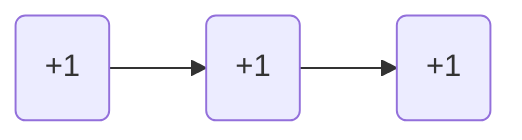
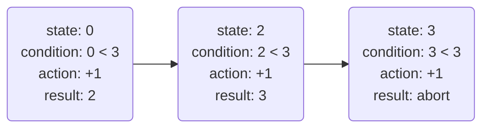

# Mahler

A automated task composer and [HTN](https://en.wikipedia.org/wiki/Hierarchical_task_network) based planner for building autonomous system agents in typescript.

**NOTE** even though this project is out of v0.x, we still consider it experimental, as we continue exploring different mechanisms to improve efficiency of various aspects of the framework. This project does adhere to the [semantic versioning guidelines](https://semver.org/), so we wont perform any breaking API changes without a major version bump.

## Features

- Simple API. Define primitive tasks by declaring the `effect` it has on the system state, a `condition` for the task to be chosen, and an `action`, which is the asynchronous operation that will be performed on the system if the task is chosen for the plan. Tasks can be used by other compound tasks (or _methods_) to guide the planner towards a desired behavior.
- Highly configurable `Agent` interface allows to create autonomous agents to serve a wide variety of use cases. Create a single shot agent to just reach a specific target, or create a service agent that keeps monitoring the state of the world and making changes as needed to keep the system on target. Agents support re-planning if the state of the system changes during the plan execution or errors occur while executing actions. This runtime context can be used as feedback to the planning stage to chose different paths if needed.
- Observable runtime. The agent runtime state and knowledge of the world can be monitored at all times with different levels of detail. Human readable metadata for tasks can be provided via the task `description` property. Plug in a logger to generate human readable logs.
- Parallel execution of tasks. The planner automatically detects when operations can be performed in parallel and creates branches in the plan to tell the agent to run concurrent operations.
- Easy to debug. Agent observable state and known goals allow easy replicability when issues occur. The planning decision tree and resulting plans can be diagrammed to visually inspect where planning is failing.

## Requirements

- Node.js 18+. Other runtimes are unsupported at this moment.

## Installation

```
npm install --save mahler
```

## Core Concepts

- **Autonomous system agent** a process on a system that needs to operate with little or not feedback from an external system. An autonomous agent needs to be able to recover from failures and adapt if conditions on the system change while performing its duties. In our definition, such an agent operates based on a given target and will keep trying to achieve the target until this changes or some other exit conditions are met.
- **Hierarchical Task Network (HTN)** is a type of automated planning system that allows to define actions in the planning domain in a hierarchical manner, allowing actions to be re-used as part of compound tasks. This reduces the search domain and provides developers more control on what plans are preferable (over something like [STRIPS](https://es.wikipedia.org/wiki/STRIPS)). This has made this type of system popular in [game design](https://www.youtube.com/watch?v=kXm467TFTcY).
- **Task** a task is any operation defined by a domain expert to provide to the planner. A task can be a primitive task, called an _action_ on this framework, e.g. "download a file", "write X to the database", or a _method_, i.e. a compound task, that provides a sequence of steps to follow.
- **Plan** a plan encodes what actions need to be executed by the agent in order to reach a certain target. Plans are represented as Directed Acyclic Graphs (DAG).
- **Target** a target is a desired state of the system. e.g, "temperature of the room == 25 degrees".
- **Sensor** a sensor is an observer of the system state, the agent can subscribe to one or more sensors in order to keep its local view of the state up-to-date and trigger re-planning if necessary.

## Design

The library design is inspired by the work in [Exploring HTN Planners through example](https://www.gameaipro.com/GameAIPro/GameAIPro_Chapter12_Exploring_HTN_Planners_through_Example.pdf).


## Basic Usage

Let's to create a system controller for a counter. For that we can use an `Agent`,

```typescript
import { Agent } from 'mahler';

const counterAgent = Agent.from({
	// The initial state of the system as known to the agent
	initial: 0,
	// A list of action or method tasks that encode knowledge about
	// operations in the system
	tasks: [],
});
```

The code above creates an agent with a counter starting at 0. We need to provide the agent with some tasks on how to control the system.

```typescript
import { Task, View } from 'mahler';

const MySystem = Domain.of<number>();

const plusOne = Task.from({
	// This means the task can only be triggered
	// if the system state is below the target
	condition: (state: number, { target }) => state < target,
	// The effect of the action is increasing the system
	// counter by 1
	// `state._` allows us to get the value pointed by the View
	effect: (state: View<number>) => ++state._,
	// An optional description. Useful for testing
	description: '+1',
});
```

The code above creates a task that has the `effect` of increasing the system state by 1 if the state is below a given target (the `condition`).

As function arguments are passed by value on JavaScript, we make use of the `View` type to allow tasks to modify the actual state passed to the function instead of a copy. The need for this will hopefully become apparent as we start to use with more complex types. Note above that only the `effect` function receives a `View<number>` while the condition property receives just a `number`. This is because only the condition should not modify the state and thus does not need to deal with views.

The code above however is a bit too verbose, though. The following is a cleaner way to do the same.

```typescript
import { Task } from 'mahler';

// Setting the generic type allows typescript to infer the values of
// the function arguments
const plusOne = Task.from<number>({
	condition: (state, { target }) => state < target,
	effect: (state) => ++state._,
	description: '+1',
});
```

Now we can give the task to the agent to use during planning.

```typescript
// The type of Agent is inferred as `Agent<number>` from the task types
const counterAgent = Agent.from({
	initial: 0,
	tasks: [plusOne],
});

// This tells the agent to find a plan from the current
// state (0) to the target state (3). `seek` starts
// the agent operation without need to await
counterAgent.seek(3);

// Wait for the agent to return some result
const res = await counterAgent.wait();
if (res.success) {
	console.log(res.state); // 3
}
```

The above code now initializes the agent with `plusOne` as its only task and tells it to find a plan that gets the system to a state equal to `3`. On `seek`, the agent will start perform the following operations:

- It will first calculate a plan to the target
- If found, it will execute the actions in the plan. If successful it will stop (by default, this can be configured)
- If no plan is found, it will wait for a bit and retry (the wait period and number of tries is configurable).
- If some error occurs while executing the plan, the agent will look for an alternative plan and continue.

In the example above, the agent should calculate a plan with 3 actions, and execute them in sequence before stopping.

The planner the agent uses can also be invoked directly, this is useful for testing our actions

```typescript
import { Planner } from 'mahler/planner';
import { plan, stringify } from 'mahler/testing';

// Create a new planner
const planner = Planner.from({ tasks: [plusOne] });

// Find a plan from 0 to 3
const res = planner.findPlan(0, 3);

// Compare the resulting plan with the desired sequence
expect(stringify(res)).to.deep.equal(sequence('+1', '+1', '+1'));
```

The code above uses the `Planner` instance exposed under the `mahler/planner` namespace as well as a couple of testing utilities. We'll learn more about these utilities further ahead.

## Actions

The previous code only acts on the internal state of the agent, and doesn't perform any side-effects. In fact, the `effect` function should **NEVER** perform side effects, as this function may be called multiple times during the planning process while searching for a path to the target.

In order to interact with the underlying system, an `action` property can be provided to the task definition. Let's imagine we want the `plusOne` task from the previous example to store the value of the counter somewhere for later retrieval using an async `storeCounter` function that returns the stored value on success. Below is how that is implemented with Mahler.

> [!NOTE]
> If no `action` property is provided, the `Task.from` constructor will use the `effect` function as the task action.

```typescript
const plusOne = Task.from<number>({
	condition: (state, { target }) => state < target,
	effect: (state) => ++state._,
	action: async (state) => {
		// The counter at runtime will only get updated
		// if storeCounter succeeds
		state._ = await storeCounter(state._ + 1);
	},
	description: '+1',
});
```

The `action` property above updates the state and stores the value. While the `action` and `effect` functions are similar, the `action` defines what will actually happen when the task is chosen as part of a plan, while the `effect` just provides a "simulation" of the changes on the system state to be used during planning.

Let's update the task to also read the stored state before updating it to avoid writing an inconsistent state.

```typescript
const plusOne = Task.from({
	// the rest of the task definition goes here
	// since action can modify state, the argument given to action
	// is also a `View`, same as effect
	action: async (state, { target }) => {
		// This is one way to deal with an out-of-date system state.
		// we can read it as part of the action body and allow the
		// agent to re-plan if it detects some inconsistency
		state._ = await readCounter();

		// We only update the stored value if it is below the target
		if (state._ < target) {
			state._ = await storeCounter(state._ + 1);
		}
	},
});
```

There is some duplication going on between the `action`, `effect` and `condition` functions. This is a necesity as the planner cannot determine the outcome of a task without executing its `effect` function. Similarly, the agent needs the `condition` function to detect if a specific task is still applicable or a re-plan is needed. This is a way to deal with non-determinism happening from the `action` functions.

For instance, let's analyze how an agent with the above task definition would execute a plan from `0` (initial state) to `3` the target state. At the end of planning stage, the agent will need to execute the following plan



When starting execution of the plan, the agent state is `0`. In the best case scenario, the agent execution will do `0 + 1 + 1 + 1 = 3` and terminate. Let's imagine now that the initial assumption about the system state being equal to `0` is wrong and when executing the first task `readCounter` returns 1.



In the above scenario, the agent will execute the first task, since as far as the agent knowledge goes, the condition holds given the current state. The task will modify the state and set it to `2`. Since the condition still holds, the agent goes and executed the second action of the plan, which updates the state to `3`. When executing the third step in the plan, the agent sees the condition no longer holds, so it aborts execution. The condition acts here as a guard preventing the agent from running an action that would potentially put the system in an inconsistent state. In this case, it allows the agent to get to the desired target state, even despite the plan not being completely executed.

Some of the duplication in the previous example can be mitigated through modeling though. We could, for instance, model the system to read the state of the world at the beginning and write at the end, which would simplify the `plusOne` task. We'll do that next.

## Target state

Let's modify our system to be less agressive with read and writes, and reduce some code duplication. We'll update our system state model to be aware of reads and writes. Let's create the model first

```typescript
type System = {
	// Our counter state
	counter: number;
	// The timestamp for the last read of the the counter
	// state obtained with performance.now()
	lastRead: number | null;

	// A boolean flag to track if the state needs
	// to be commited to storage
	needsWrite: boolean;
};
```

The new model now keeps track of reads via a timestamp, we'll use that property to ensure the agent knows that the counter state is up to date before making changes. Writes are tracked via a boolean flag, we can use that flag when setting a target to make sure the state is commited to storage. Let's write a `read` and `store` tasks.

```typescript
// This is the maximum time allowed between reads
const MAX_READ_DELAY_MS = 1000;

const read = Task.from<System>({
	// We only read if the state is out of date.
	condition: (state) =>
		state.lastRead == null ||
		performance.now() - state.lastRead > MAX_READ_DELAY_MS,
	effect: (state) => {
		// The effect of the task is resetting of the timer
		state._.lastRead = performance.now();
	},
	action: async (state) => {
		// The action reads the counter and resets the timer
		state._.counter = await readCounter();
		state._.lastRead = performance.now();
	},
	description: 'readCounter',
});

const store = Task.from<System>({
	// We only write after the system counter has reached the target
	condition: (state, { target }) =>
		state.counter === target.counter && state.needsWrite,
	// The effect of the store task is toggle the needsWrite flag
	effect: (state) => {
		state._.needsWrite = false;
	},
	action: async (state) => {
		// We write the counter and toggle the flag
		state._.counter === (await storeCounter(state._.counter));
		state._.needsWrite = false;
	},
	description: 'storeCounter',
});
```

We can now modify the `plusOne` task to only perform the update operation.

```typescript
const plusOne = Task.from<System>({
	condition: (state, { target }) =>
		state.counter < target.counter &&
		// We'll only update the counter if we know the internal counter is
		// synchronized with the stored state
		(state.lastRead == null ||
			state.lastRead + MAX_READ_DELAY_MS >= performance.now()),
	// The task has the effect of updating the counter and modifying the write requirement
	// We no longer need to set an action as this operation no longer performs IO
	effect: (state) => {
		state._.counter++;
		state._.needsWrite = false;
	},
	description: '+1',
});
```

The tasks above now will make sure that no counter changes can happen if more than 1 second has passed between reads, that condition will make sure a `read` operation is added first to the plan. A `store` will happen only once the counter target has been reached, this ensures that this action is always put last on the plan. This can be tested as follows.

```typescript
const planner = Planner.from({ tasks: [plusOne, read, store] });

// Find a plan from 0 to 3
const res = planner.findPlan(
	{ counter: 0, needsWrite: false },
	{ counter: 3, needsWrite: false },
);
expect(stringify(res)).to.deep.equal(
	sequence('readCounter', '+1', '+1', '+1', 'storeCounter'),
);
```

Let's talk for a second about the functions passed as task properties: `condition`, `effect` and `action`. Until now we have seen that they receive the system state (or a `View<System>`) as the first argument. These functions also receive a second argument, that can be seen in the `plusOne` definition above where we used [object destructuring](https://developer.mozilla.org/en-US/docs/Web/JavaScript/Reference/Operators/Destructuring_assignment) to get the `target`, property. The second argument is called the `Context` object and it contains relevant metadata about the the context where the task is being used. We'll talk more about the context argument when we talk about [Lenses](#lenses). For now let us dive into the target property and the target state property.

You'll most likely have deduced by now that the `target` property has the type of the task generic argument (i.e. `System` in this case) and contains the target state passed to the planner. In our last example this means the target will be `{ counter: 3, needsWrite: false }`.

It's worth pointing out that the second argument of `findPlan` above, or the argument to `Agent.seek` in this case is not a `System` type, but of `Target<System>`. This is a [special type](lib/target.ts) that allows to provide partial versions of the type argument. This helps us to provide the planner/agent only with those parts of the state we care about as target. Let's say in our previous example, that we don't care if the counter is commited to storage just yet. We could do it with

```typescript
// Find a plan from 0 to 3. Since we don't give a value for `needsWrite`, the planner will not
// add the storeCounter task to the plan
const res = planner.findPlan({ counter: 0, needsWrite: false }, { counter: 3 });
expect(stringify(res)).to.deep.equal(sequence('readCounter', '+1', '+1', '+1'));
```

This goes into the implementation of the planner. When we provide `{ counter: 3 }` as target, we are telling the planner to stop as soon as it finds that `counter === 3`. If we provide `{ counter: 0, needsWrite: false }`, we are telling the planner to stop when `counter === 3 && needsWrite === false`. Since the `plusOne` actions in our plan flip the value for `needsWrite` to `true`, after reaching `counter === 3` the planner knows it still needs to look for another task to flip the `needsWrite` flag back to `false`.

What about deletes? If `Target<System>` is a partial type on the `System` type, how can we tell the planner if we want to delete a value? Mahler provides the symbol `UNDEFINED` to achieve this.

```typescript
import { UNDEFINED } from 'mahler';

// This won't find a plan since we have no action defined to
// delete the lastRead property
const res = planner.findPlan(
	{ counter: 0, needsWrite: false },
	{ counter: 3, lastRead: UNDEFINED },
);
```

The example above is a bit nonsensical, but it shows how the `UNDEFINED` symbol would be used. This tells the planner that we want the `lastRead` property removed from the state object, so the planner would look for a task that results in the deletion of that property. Note that this is different than setting the value to `undefined`. The difference is shown below

```typescript
// If successful, it should result in the following state: {counter: 3, needsWrite: true}
agent.seek({ counter: 3, lastRead: UNDEFINED });

// If successful, it should result in the following state: {counter: 3, needsWrite: true, lastRead: undefined}
agent.seek({ counter: 3, lastRead: undefined });
```

You can also use the `seekStrict` function of `Agent` to tell the agent to look for the exact state given as the target

```ts
// This tells the agent the exact system state that
// we want to see at the end of the run.
agent.seekStrict({ counter: 3, needsWrite: true });

// The above is equivalent to
agent.seek({ counter: 3, lastRead: UNDEFINED });
```

We'll learn later how we can add an `op` property to tasks to tell Mahler when a task is applicable to a `delete` [operation](#operations).

One last thing before moving on from this topic. What if you assign a required value the value of `UNDEFINED`?

```typescript
// Compilation fais with: `type symbol is not assignable to number|undefined`
agent.seek({ counter: UNDEFINED });
```

The compiler will prevent you from doing that to avoid ending up with inconsistent state (as long as you don't use `as any`).

## Methods

Now, as programmers, we want to be able to build code by composing simpler behaviors into more complex ones. We might want to guide the planner towards a specific solution, using the primitives we already have. For instance, let's say we want to help the planner get to a solution faster as adding tasks one by one takes too much time. We want to define a `plusTwo` task, that increases the counter by `2`. We could create another primitive task to update the counter by two, but as programmers, we would like to reuse the code we have already defined. We can do that using methods.

```typescript
// We'll go back to the simpler definition for this example
const plusOne = Task.from<number>({
	condition: (state, { target }) => state.counter < target,
	effect: (state) => ++state._,
	description: '+1',
});

// Inspecting the plusTwo variable shows that this variable is of type `MethodTask`
const plusTwo = Task.from<number>({
	// We want this method to be chosen only if the difference between the current
	// state and the target is bigger than one
	condition: (state, { target }) => target - state > 1,
	// Defining the method property makes this task into a method
	// A method should not modify the state, just return a sequence of applicable actions
	method: (_, { target }) => [plusOne({ target }), plusOne({ target })],
	description: '+2',
});
```

Now there is a lot happening here. We have replaced `effect` and `action` in the task constructor with `method`. We are also directly using the `plusOne` task as a function and passing the target as one of the properties of the argument object. Let's parse this example piece by piece.

The code above is the way to create composite tasks in Mahler, called methods. Using `method` tells the task constructor to return a `MethodTask` instead of an `ActionTask` (like `plusOne`).

A method should not directly modify the state, but return instead a sequence of actions that are applicable under the given conditions. As we see above, in this case, the method returns a sequence of two `plusOne` tasks applied to the target.

Objects generated by task constructors are callable, and receive part of the `Context` as the argument. Passing the context to a task binds it to the context, and this happens normally as part of the planning process. However, we reuse this mechanism to be able to reuse tasks as part of methods.

```typescript
// Another test utility
import { zip } from 'mahler/testing';

// plusOneAction is of type `Action`
const plusOneAction = plusOne({ target: 3 });

// `zip` packs the action (including condition) and returns
// a callable function
const doPlusOne = zip(plusOneAction);

// This executes the action. Useful for testing
console.log(await doPlusOne(0)); // 1

// plusTwoMethod is of type `Method`
const plusTwoMethod = plusTwo({ target: 3 });

// zip in this case expands the method into its actions so it can be applied
// as if it was a function
const doPlusTwo = zip(plusTwoMethod);
console.log(await doPlusTwo(0)); // 2
```

Methods are useful for tweaking the plans under certain conditions. They also help reduce the search space. When looking for a plan, the Planner will try methods first, and only if methods fail, proceed to look for action tasks. During planning, the method is expanded recursively into its component actions, so they won't appear on the final plan.

```typescript
const planner = Planner.from({
	tasks: [plusOne, plusTwo],
});

const res = planner.findPlan(0, 3);

// The method has already been expanded
expect(stringify(res)).to.deep.equal(sequence('+1', '+1', '+1'));
```

We can see method expansion by diagramming the planning process. Mahler provides a test util to generate [Mermaid](https://mermaid.js.org/) diagrams. We can construct the tracer using the mermaid function and pass it as a configuration to the planner.

```typescript
import { mermaid } from 'mahler/testing';

// Create a tracer using the mermaid tool.
const trace = mermaid();
const planner = Planner.from({
	tasks: [plusOne, plusTwo],
	// Pass the trace as a configuration option to the planner
	config: { trace },
});

// Find a plan from 0 to 3
const res = planner.findPlan(0, 3);

// render() returns a mermaid valid graph
console.log(trace.render());
```

Passing the output to the [Mermaid Live Editor](https://mermaid.live) will produce the following diagram.

```mermaid
graph TD
    start(( ))
    start -.- d0{ }
    d0 -.- f751444[["+2"]]
    f751444 -.- b795d43("+1")
    b795d43 -.- 4eb0bdd("+1")
    4eb0bdd -.- d1{ }
    d1 -.- 580ece0[["+2"]]
    580ece0 -.- 580ece0-err[ ]
    580ece0-err:::error
    d1 -.- d634a71("+1")
    d634a71 -.- stop(( ))
    stop:::finish
    classDef finish stroke:#000,fill:#000
    start:::selected
    start --> b795d43
    b795d43:::selected
    b795d43 --> 4eb0bdd
    4eb0bdd:::selected
    4eb0bdd --> d634a71
    d634a71:::selected
    d634a71 --> stop
    classDef error stroke:#f00
    classDef selected stroke:#0f0
```



In the diagram, the nodes connected via the dotted lines show the planning process, while nodes connected via the solid arrows show the resulting plan. The diagram shows how the planner tries first the `+2` method, which results into the expansion `('+1', '+1')`, a second try of the method fails, because the condition no longer holds, so the planner adds a `+1` action next, which allows the planner to reach the target.

Let's compare this diagram with one where the planner doesn't know the `plusTwo` method. This new diagram looks like this:



```mermaid
graph TD
    start(( ))
    start -.- d0{ }
    d0 -.- 2586e9e("+1")
    2586e9e -.- d1{ }
    d1 -.- 82f6258("+1")
    82f6258 -.- d2{ }
    d2 -.- a1f7280("+1")
    a1f7280 -.- stop(( ))
    stop:::finish
    classDef finish stroke:#000,fill:#000
    start:::selected
    start --> 2586e9e
    2586e9e:::selected
    2586e9e --> 82f6258
    82f6258:::selected
    82f6258 --> a1f7280
    a1f7280:::selected
    a1f7280 --> stop
    classDef error stroke:#f00
    classDef selected stroke:#0f0
```

Here we see here that the planner needs to perform 3 iterations (the diamond nodes) to find a plan to the target.

Methods can also call other methods. We can now write `plusThree` using `plusOne` and `plusTwo`

```typescript
const plusThree = Task.from<number>({
	condition: (state, { target }) => target - state > 2,
	// Methods can be referenced from other methods
	method: (_, { target }) => [plusTwo({ target }), plusOne({ target })],
	description: '+3',
});
```

> [!NOTE]
> Methods cannot call themselves recursively or as part of call chain. This is forbidden to prevent infinite recursion. Using recursion means the method will effectively never be called.

## Lenses

Let's say now that we want our agent to manage multiple counters. Let's redefine our system state once more to do this

```typescript
type System = { counters: { [key: string]: number } };
```

We can now easily (?) redefine our `plusOne` task to handle this case.

```typescript
const plusOne = Task.from<System>({
	// This task will be chosen only if one of the keys is smaller than the target
	condition: (state, { target }) =>
		Object.keys(state.counters).some(
			(k) => state.counters[k] < target.counters[k],
		),
	effect: (state, { target }) => {
		// We find the first counter below the target, we know it exists because of
		// the condition so we use the non-null assertion (!) at the end
		const key = Object.keys(state._.counters).find(
			(k) => state._.counters[k] < target.counters[k],
		)!;

		// Update the changed counter
		state._.counters[key]++;
	},
	description: '+1',
});
```

The above code achieves the same as the single counter `plusOne` (increase one of the counters), but is a bit convoluted, and we cannot tell from the description which counter will be increased. We can improve this by setting the `lens` property when defining the action.

```typescript
const plusOne = Task.of<System>().from({
	// The lens defines the part of the state where this task is applicable
	// this property defaults to '/', meaning the root object
	lens: '/counters/:counterId',
	condition: (counter, { target }) => counter < target,
	effect: (counter) => ++counter._,
	description: ({ counterId }) => `${counterId} + 1`,
});
```

We are again introducing a few new things here, but hopefully the code above is relatively intuitive. This declares `plusOne` as a task on the `System` type, but that acts on a specific counter, specified by the lens property. Since we don't know a priori which counter this will apply to, we replace the name of the counter with the placeholder variable, `:counterId`. This variable is passed as part of the context to the task constructor properties. We can see this in the definition of `description`, where we use `counterId`. By the way, this also shows that the description can also be a function acting on the context.

Note also that instead of the usual `Task.from` we preface the `from` call with a `Task.of` with a generic type argument. This is because of a limitation in typescript that does not allow it to [perform partial inference of generic types](https://github.com/microsoft/TypeScript/issues/10571). We'll see later how we can shorten this call by using a [domain](#domains).

Now we can go a bit deeper on the context object, we mentioned before that it contains the context from the task selection process during planning. More specifically, the context object is composed by

- A `target` property, with the expected target value for the part of the state that the task acts on. This will have the same type as the first argument of the function, which will match the type pointed by the `lens` property. We'll see when we talk about [operations](#operations) that this property is not present for delete or wildcard (`*`) operation.
- A `system` property, providing a copy of the global state at the moment the task is used. This can be used, for instance, to define tasks with conditions on parts of the system that are unrelated to the sub-object pointed to by the lens.
- A `path` property, indicating the full path of the lens where the task is being applied.
- Zero or more properties with the names of the placeholders in the lens definition. For instance is the lens is `/a/:aId/b/:bId/c/:cId`, `aId`, `bId`, and `cId` will be provided in the context, with the right type for the property within the path.

> [!NOTE]  
> Lenses allow us to have tasks operate on a part of the state to allow cleaner code. While the framework provides the `system` property to be able to reference unrelated parts of the state object, it should be used sparingly as the code will quickly get harder to follow. If you find that you are using the `system` property too often, consider refactoring of your model.

The name _lens_ comes from the [lens concept in functional programming](https://en.wikibooks.org/wiki/Haskell/Lenses_and_functional_references), that are these structures that provide a view into a specific part of an object, allowing to read and modify values without needing to manipulate the full object. They can be thought as analogous to database views. However, unlike traditional database views or functional lenses, in order to make lenses useful in the context of tasks we need them to be bi-directional, that is, a modification to the contents of the view should affect the original data and vice-versa. For now the only supported lens allows us to _focus_ into a specific sub-property of the system model, however, we would like to add some more powerful lenses in the future based on existing work in this area (see the work by [Foster et al](https://www.cis.upenn.edu/~bcpierce/papers/lenses-toplas-final.pdf), [Hoffman et al](http://dmwit.com/papers/201107EL.pdf) and [Project Cambria](https://www.inkandswitch.com/cambria/)).

> [!NOTE]
> Hopefully this makes it clearer the reason the `View` name was chosen to pass [references to effect and action functions](#basic-usage), changes to the view are indeed propagated to the global state object.

We can reuse these tasks in methods the same way as before, but we need to pass the values for the placeholder variables along with the target.

```typescript
const plusTwo = Task.of<System>().from({
	lens: '/counters/:counterId',
	condition: (counter, { target }) => target - counter > 1,
	method: (_, { target, counterId }) => [
		plusOne({ target, counterId }),
		plusOne({ target, counterId }),
	],
	description: ({ counterId }) => `${counterId} + 2`,
});
```

## Parallelism

What happens with the above case if we look for a plan for multiple counters? What will be the plan generated below?

```typescript
const planner = Planner.from({
	tasks: [plusOne],
});

// Find a plan from 0 to 3
const res = planner.findPlan(
	{ counters: { a: 0, b: 0 } },
	{ counters: { a: 2, b: 2 } },
);
```

Again we can draw the plan using the mermaid test helper

```mermaid
graph TD
        start(( ))
        start -.- d0{ }
        d0 -.- 4418a5c("a + 1")
        4418a5c -.- d1{ }
        d1 -.- a53644f("a + 1")
        a53644f -.- d2{ }
        d2 -.- 47bcbb6("b + 1")
        47bcbb6 -.- d3{ }
        d3 -.- a48a56b("b + 1")
        a48a56b -.- stop(( ))
        stop:::finish
        classDef finish stroke:#000,fill:#000
        start:::selected
        start --> 4418a5c
        4418a5c:::selected
        4418a5c --> a53644f
        a53644f:::selected
        a53644f --> 47bcbb6
        47bcbb6:::selected
        47bcbb6 --> a48a56b
        a48a56b:::selected
        a48a56b --> stop
        classDef error stroke:#f00
        classDef selected stroke:#0f0
```



Even though the `a + 1` and `b + 1` actions modify totally different parts of the state, the planner still comes up with a sequential plan. This is a limitation of the planner right now, that we intend to improve in the future. Not all is bad news though, the planner does support parallel planning for methods. Let's define a generic `nPlusOne` task that increases any pending counters.

```typescript
const nPlusOne = Task.of<System>().from({
	lens: '/counters',
	condition: (counters, { target }) =>
		Object.keys(counters).some((k) => counters[k] < target[k]),
	method: (counters, { target }) =>
		Object.keys(counters)
			.filter((k) => counters[k] < target[k])
			.map((k) => plusOne({ counterId: k, target: target[k] })),
	description: 'counters++',
});

const planner = Planner.of({
	tasks: [plusOne, nPlusOne],
	config: { trace },
});

planner.findPlan({ counters: { a: 0, b: 0 } }, { counters: { a: 2, b: 2 } });
```

Here is how the plan looks now.

```mermaid
graph TD
        start(( ))
        start -.- d0{ }
        d0 -.- 10de649[["counters++"]]
        10de649 -.- c68b28e("a + 1")
        10de649 -.- 49589fa("b + 1")
        c68b28e -.- j8cb35b9
        49589fa -.- j8cb35b9
        j8cb35b9(( ))
        j8cb35b9 -.- d1{ }
        d1 -.- 5787f35[["counters++"]]
        5787f35 -.- 65925ed("a + 1")
        5787f35 -.- a8de3b6("b + 1")
        65925ed -.- jce8b4d8
        a8de3b6 -.- jce8b4d8
        jce8b4d8(( ))
        jce8b4d8 -.- stop(( ))
        stop:::finish
        classDef finish stroke:#000,fill:#000
        start:::selected
        start --> fj8cb35b9(( ))
        fj8cb35b9:::selected
        fj8cb35b9 --> c68b28e
        c68b28e:::selected
        fj8cb35b9 --> 49589fa
        49589fa:::selected
        j8cb35b9(( ))
        c68b28e --> j8cb35b9
        49589fa --> j8cb35b9
        j8cb35b9:::selected
        j8cb35b9 --> fjce8b4d8(( ))
        fjce8b4d8:::selected
        fjce8b4d8 --> 65925ed
        65925ed:::selected
        fjce8b4d8 --> a8de3b6
        a8de3b6:::selected
        jce8b4d8(( ))
        65925ed --> jce8b4d8
        a8de3b6 --> jce8b4d8
        jce8b4d8:::selected
        jce8b4d8 --> stop
        classDef error stroke:#f00
        classDef selected stroke:#0f0
```



As we can see, for the `counters++` method, the planner detected that there were no conflicts between the steps returned by the method and automatically generated parallel branches for the plan. If conflicting changes were found between the branches, the planner would have reverted to a sequential execution (as it happens with `plusTwo` in our previous examples). Plans generated this way also tell the agent that is safe to execute tasks in the given branches using `Promise.all`, allowing faster execution overall.

This process is not perfect though, the planner can only detect if writes to the same part of the state happen, but what happens if one of the returned tasks of the method reads a value that is modified by the parallel branch? What would happen for instance with a method like the following?

```typescript
const plusOneAndStore = Task.from({
	method: (_, { target }) => [plusOne({ target }), store({ target })],
});
```

The `store` action depends on the state being updated by `plusOne` before it has anything to store, so parallel execution of this method will fail. This is again due a limitation of the planner that it cannot yet "see" into the action implementation, and as such, it doesn't know if an action is performing a read that conflicts with a write of the parallel branch. To solve this we provide the `expansion` property for methods, that allows to force sequential expansion of the method as follows.

```typescript
const plusOneAndStore = Task.from<number>({
	// Force sequential expansion of the method.
	// Supported values are 'detect' (default) or 'sequential'
	expansion: 'sequential',
	method: (_, { target }) => [plusOne({ target }), store({ target })],
});
```

Going back to the `nPlusOne` example. How can we test that the generated plan meets our expectations? Mahler also provides test helpers for parallel plans

```typescript
import { stringify, plan, branch } from 'mahler/testing';

const res = planner.findPlan(
	{ counters: { a: 0, b: 0 } },
	{ counters: { a: 2, b: 2 } },
);

// Compare the resulting plan to our expectation
expect(stringify(res)).to.deep.equal(
	// Start a plan
	plan()
		// A fork with two branches, with one action each
		.fork(branch('a + 1'), branch('b + 1'))
		.fork(branch('a + 1'), branch('b + 1'))
		// Convert the plan to a string for comparison
		.end(),
);
```

Internally, the code above converts plans to a string representation for easier comparison using diff tools. Here is how the plan above would be represented

```
+ ~ - a + 1
  ~ - b + 1
+ ~ - a + 1
  ~ - b + 1
```

This represents a plan with two forks, each fork with two parallel branches of a single action each.

Here is what the symbology above can be read

- `+` denotes a fork in the plan, the point where the plan splits into branches
- `~` denotes a branch of a fork
- `-` denotes an element of the branch
- Indentation denotes the level that the symbol is on with respect to the previous code

A couple of examples. The following represents a sequence of `a + 1` actions.

```
- a + 1
- a + 1
- a + 1
```

The following represents a plan with a fork with two branches, each one with two actions. The fork is followed by a single `a + 1` action.

```
+ ~ - a + 1
    - a + 1
  ~ - b + 1
    - b + 1
- a + 1
```

Symbols can be also chained for a more compact representation, can you figure out what the following means?

```
+ ~ + ~ - a++
        - a++
      ~ - b++
        - b++
  ~ + ~ - c++
        - c++
      ~ - d++
        - d++
- a++
```

## Operations

### Initializing data

What does the planner return in the following scenario?

```typescript
type System = { counters: { [key: string]: number } };

const plusOne = Task.of<System>().from({
	lens: '/counters/:counterId',
	condition: (counter, { target }) => counter < target,
	effect: (counter) => ++counter._,
	description: ({ counterId }) => `${counterId} + 1`,
});

const planner = Planner.from({
	tasks: [plusOne],
	config: { trace },
});

const res = planner.findPlan(
	{ counters: { a: 0 } },
	{ counters: { a: 2, b: 1 } },
);
console.log(res.success); // false
```

In the above case the planner fails to find a plan, let's quickly analyze why. When given a target, the planner will calculate the pending changes between the current state and the target. When first starting the planner sees there that two operations are needed to get to the target, an update operation of counter `a` and a create operation of counter `b`, this is internally represented as below.

```typescript
[
	{ op: 'update', path: '/a', value: 2 },
	{ op: 'create', path: '/b', value: 1 },
];
```

Tasks by default apply to `update` operations, meaning the planner will know to chose the `plusOne` task to serve the `update` operation, but it will not find any task to serve the `create` operation and hence planning fails. In the above scenario we would like perhaps that the planner would infer that counters start at `0`, but while that may work for this simple example, it is not true in the general case, particularly when dealing with more complex types. Moreover, creating a new counter could require some side effects that the planner could not anticipate.

In order to allow the planner to find a plan here, we need to provide a task for a `create` operation.

```typescript
const initCounter = Task.of<System>().from({
	// This tells the planner that the task is applicable to a 'create' operation
	// valid values are 'update' (default), 'create', 'delete', or '*'
	op: 'create',
	lens: '/counters/:counterId',
	// No condition is needed in this case, the task will be chosen only if the counter
	// is undefined
	effect: (counter) => {
		// Set the initial state for the counter
		counter._ = 0;
	},
	description: ({ counterId }) => `${counterId} = 0`,
});
```

If we now add our task to the planner to look for the plan

```typescript
const planner = Planner.from({
	tasks: [plusOne, initCounter],
	config: { trace },
});

const res = planner.findPlan(
	{ counters: { a: 0 } },
	{ counters: { a: 2, b: 1 } },
);
```

Will now yield the following plan

```mermaid
graph TD
        start(( ))
        start -.- d0{ }
        d0 -.- 6d8d899("a + 1")
        6d8d899 -.- d1{ }
        d1 -.- 99adff5("a + 1")
        99adff5 -.- d2{ }
        d2 -.- 9312e2b("b = 0")
        9312e2b -.- d3{ }
        d3 -.- fd40601("b + 1")
        fd40601 -.- stop(( ))
        stop:::finish
        classDef finish stroke:#000,fill:#000
        start:::selected
        start --> 6d8d899
        6d8d899:::selected
        6d8d899 --> 99adff5
        99adff5:::selected
        99adff5 --> 9312e2b
        9312e2b:::selected
        9312e2b --> fd40601
        fd40601:::selected
        fd40601 --> stop
        classDef error stroke:#f00
        classDef selected stroke:#0f0
```



### Deleting data

What about deletion? What if you want to search for the following plan?

```typescript
const res = planner.findPlan(
	{ counters: { a: 0, b: 1 } },
	{ counters: { a: 2, b: UNDEFINED } },
);
```

Same thing applies, the planner doesn't know if it can safely delete the value, so it will fail unless it finds a `delete` task that is applicable to the path.

```typescript
const delCounter = Task.of<System>().from({
	op: 'delete',
	lens: '/counters/:counterId',
	// No condition is needed in this case, the task will be chosen only if the value
	// exists
	effect: () => {
		// perform necessary cleanup here, no need to delete the counter as that happens automatically
	},
	description: ({ counterId }) => `delete ${counterId}`,
});
```

Once the effect/action functions have succeeded, the library will remove the counter.

Is important to note that delete tasks do not have a `target` property in their context argument as that value is undefined for this type of operation.

### Wildcard tasks

In some cases, we may want to create tasks that are applicable to any operation, because we want to deal with complexity inside the task functions or some other reason. In that case, Mahler allows to use `*` (wildcard) as the value of the `operation` value. These tasks will be tried by the planner if the path for the pending operation matches, no matter what the operation is. As with `delete` operations, wildcard tasks don't have a context `target` property. Unlike `delete` operations though, the library will not automatically delete the value once the effect/action functions are executed. Here is how we would define our `delCounter` task as a wildcard task.

```typescript
const delCounter = Task.of<System>().from({
	op: '*',
	lens: '/counters/:counterId',
	effect: (counter) => {
		// we need to manually delete the counter here as the library cannot infer this step for wildcard tasks
		counter.delete();
	},
	description: ({ counterId }) => `delete ${counterId}`,
});
```

The `View` type provides the convenience `delete()` method for such scenario.

### Operation precedence

What if for a given operation we have multiple tasks that are applicable? For instance, for an `update` operation on path `/counters/a`, we could have a task that applies to the path `/counters` (as with the parallel update example) and a task that applies to a given counter (like `plusOne`). In that case, the planner will try to apply the task that applies to highest level path first (`/counters` in this case), only if that fails, it will try the task that is applicable to `/counters/a`.

In fact, when comparing the current state and target state, the planner will look for task that fits on every level. With our previous example, when comparing `{ counters: { a: 0 } }` and `{ counters: { a: 0, b: 1 } }` the planner will start from the root path looking for applicable operations, as shown below.

```typescript
[
	{ op: 'update', path: '/', value: { counters: { a: 0, b: 1 } } },
	{ op: 'update', path: '/counters', value: { a: 0, b: 1 } },
	{ op: 'create', path: '/counters/b', value: 1 },
];
```

Let's look at a couple more examples

Comparing `{ a: {} }` to `{ a: { b: { c: 0 } } }`, will cause the planner to look for tasks applicable to the following operations

```typescript
[
	{ op: 'update', path: '/', value: { a: { b: { c: 0 } } } },
	{ op: 'update', path: '/a', value: { b: { c: 0 } } },
	{ op: 'create', path: '/a/b', value: { c: 0 } },
];
```

We can see above that the planner will stop the search when a `create` operation is found.

Comparing `{ a: { b: { c: 0 } } }` to `{ a: { b: { c: 1 } } }`, will cause the planner to look for tasks applicable to the following operations

```typescript
[
	{ op: 'update', path: '/', value: { a: { b: { c: 1 } } } },
	{ op: 'update', path: '/a', value: { b: { c: 1 } } },
	{ op: 'update', path: '/a/b', value: { c: 1 } },
	{ op: 'update', path: '/a/b/c', value: 1 },
];
```

For `delete` operations, the planner will expand the search to sub-elements of the deleted property. For example, comparing `{ a: { b: { c: { d: 'e' } } } }` to `{ a: { b: UNDEFINED } }`, will cause the planner to look for tasks applicable to the following operations

```typescript
[
	{ op: 'update', path: '/', value: { a: {} } },
	{ op: 'update', path: '/a', value: {} },
	{ op: 'delete', path: '/a/b' },
	{ op: 'delete', path: '/a/b/c' },
	{ op: 'delete', path: '/a/b/c/d' },
];
```

This is because of the implied hierarchy in the state, deleting a value of type `/a/b` may need to make sure that no sub-elements of type `c` exist before the delete can take place. This is similar to a database, where deletes of related entities required requires cascading deletes.

The planner doesn't enforce any hierarchy though, so it is up to the developer to add conditions to tasks to let the planner know if certain delete sequence is necessary.

## Task precedence

As mentioned before, the planner uses root to leaf precedence related to changing paths. When multiple tasks are applicable to the same path, the planner will use Method tasks first and then chose tasks in order of insertion in the task array given to the planner.

## Domains

Tasks can be grouped in a domain for less verbose code

```typescript
import { Domain } from 'mahler';

const MySystem = Domain.of<System>();

const myTask = MySystem.task({
	// task definition here
});
```

This is also true for sensors, which we describe in the [next section](#sensors)

```typescript
const mySensor = MySystem.sensor({
	// sensor definition here
});
```

## Sensors

We are almost done introducing concepts, before continuing however, let's move to a better example. Let's write an agent for a simple Space Heater controller. The heater design is very simple, it is composed by a resistor that can be turned ON or OFF to heat the room, and a termometer that detects the room temperature. The heater interface allows to set a target room temperature. The controller will turn the resistor ON if the temperature is below target or OFF if the temperature is above target.

Let's start first by modelling the state. As the per the hardware design, the state needs to keep track of the resistor state and the room temperature.

```typescript
import { Domain, Agent } from 'mahler';

type Heater = { roomTemp: number; resistorOn: boolean };

// We'll reuse the type name for the domain
const Heater = Domain.of<Heater>();
```

Now let's define a task for turning the heater ON.

```typescript
const turnOn = Heater.task({
	// Only run this task if the room temperature is below target
	condition: (state, { target }) =>
		state.roomTemp < target.roomTemp && !state.resistorOn,
	// What should the planner expect after running this task
	effect: (state, { target }) => {
		// Turning the resistor ON does not change the temperature
		// immediately, but the effect is that the temperature 'eventually'
		// will reach that point
		state._.roomTemp = target.roomTemp;
		state._.resistorOn = true;
	},
	// The actual operation that will be executed by the plan runner
	action: async (state) => {
		// Call the I/O operation to turn the resistor on
		await turnResistorOn();
		state._.resistorOn = true;
	},
	// A description of the task to use for logging purposes
	description: 'turn resistor ON',
});
```

We also need to define another task to turn the heater resistor OFF.

```typescript
const turnOff = Heater.task({
	condition: (state, { target }) =>
		state.roomTemp > target.roomTemp && !!state.resistorOn,
	effect: (state, { target }) => => {
		state._.roomTemp = target.roomTemp;
		state._.resistorOn = false;
	},
	action: async (state) => {
		await turnResistorOff();
		state._.resistorOn = false;
	},
	description: 'turn resistor OFF',
});
```

These two tasks specify the case where the temperature is off-target and the resistor is in the wrong state, however, what happens if the resistor is in the right state, but the temperature just has not been reached yet? In that case the planner would not be able to find any applicable tasks and fail. We can solve this by defining a task to handle this case.

```typescript
const wait = Heater.task({
	condition: (state, { target }) =>
		// We have not reached the target but the resistor is already OFF
		(state.roomTemp > target.roomTemp && !state.resistorOn) ||
		// We have not reached the target but the resistor is already ON
		(state.roomTemp < target.roomTemp && !!state.resistorOn),
	effect: (state, { target }) => {
		state._roomTemp = target.roomTemp;
	},
	// Nothing to do here, we let the agent wait
	action: async () => void 0,
	description: 'wait for temperature to reach target',
});
```

Now, these tasks define the behaviour of our agent under certain conditions, but the agent cannot control the temperature of the room, it can only measure it at certain points in time. For this sort of situation, Mahler provides the `Sensor` interface.

```typescript
// Sensor.of<Heater>.from works here too
const temperature = Heater.sensor({
	// The sensor returns values to set the path given by the lens below
	// (no lens variables supported in this case)
	lens: '/roomTemp',
	// The sensor is a generator function that yields values obtained from
	// the measuring hardware
	sensor: async function* () {
		while (true) {
			yield await readTemperature();
			await setTimeout(1000);
		}
	},
});
```

To define the sensor, we need to provide it with a [generator function](https://developer.mozilla.org/en-US/docs/Web/JavaScript/Guide/Iterators_and_Generators#generator_functions), which can be synchronous or [asynchronous](https://developer.mozilla.org/en-US/docs/Web/JavaScript/Reference/Global_Objects/AsyncGenerator). Every time the generator yields a new value, this will tell the agent to update the part of the state indicated by the lens.

Now that we have our tasks and our sensor defined, we can create our heater agent.

```typescript
const heaterAgent = Agent.from({
	// Provide the initial state of the world
	initial: { roomTemp: 10, resistorOn: false },

	// The tasks that the agent uses for planning
	tasks: [turnOn, turnOff, wait],

	// The sensors the agent uses to read the system state
	sensors: [termometer],

	// The `follow` flag tells the agent to keep monitoring
	// the state and re-plan if the state gets off-target.
	// By default, the agent wil terminate as soon as the
	// target has been reached.
	opts: { follow: true },
});
```

With that we can start the Heater controller with a specified target.

```typescript
// Set the heater target temperature to 23 degrees
heaterAgent.seek({ roomTemp: 23 });
```

The above instruction will start the agent and have it run forever (because of the `follow: true`). The Heater will continue monitoring the room temperature and turning the resistor ON or OFF as the temperature goes outside the expected value.

## Observing the system state

What if we want other part of our system to act on temperature changes? Perhaps we need to send temperature updates to a backend, or update some UI with the current state of the system. Agents are [observable](https://rxjs.dev/guide/observable), meaning we can subscribe to state updates. In the previous example

```typescript
// Print the state every time it changes to the console
const subscription = heaterAgent.subscribe(console.log);
```

The `subscribe` function receives an Observer (or just a function). The `next` function will be called every time some part of the state changes.

The agent runtime will also monitor changes to the state that happens while an action is being executed, imagine you have a task with a long running action to fetch something from another server

```typescript
const fetch = Task.from<System>({
	// The rest of the task definition here
	action: async (resource, { target }) => {
		// The second argument to the function is a callback to
		// provide progress updates
		const blob = await fetchData(target.URL, (progress) => {
			// Store the progress as part of the system state
			resource._.downloadProgress = progress;
		});
	},
});
```

In the case above, an agent when calling an action from the above task will update subscribers every time the download progress is updated.

In order to unsubscribe from agent updates, we can use the `unsubscribe` method of the returned subscription.

```typescript
subscription.unsubscribe();
```

### Logging Agent and Planner

Mahler provides a [Logger interface](lib/logger.ts) to provide text feedback to the internal process during the planning and execution contexts.

```typescript
const agent = Agent.from({
	initial: 0,
	tasks: [],
	opts: { logger: { info: console.log, error: console.error } },
});
```

Passing a `trace` function to the agent will allow to get structured feedback of the planning progress. The rest of the functions (debug, info, warn,error) are called only by the agent runtime with textual information with different levels of detail. We intend to move to an [open telemetry](https://github.com/balena-io-modules/mahler/issues/40) for standardized logging.

## Troubleshooting

This concludes the introduction of concepts. Here is some troubleshooting in case your agents are not working as expected.

### Planner adds the same instruction over and over and terminates without finding a plan

While the planner has some loop detection capabilities, it can only detect if an action is being applied on the same state twice. This means there can be actions that are considered applicable and modify the state without actually contributing to the overall target. In this case, the action may be added forever (until the maximum stack depth is reached). If this is happening to you, check the condition for the task that is being added (you'll see it in the planner logs), it is possible that the condition is not restrictive enough if the task is being chosen each time. A good heuristic for conditions is that the condition should _eventually_ become false after applying the task a number of times.

To avoid looping forever, the planner allows a maximum search depth of size `1000`, this can be configured via the planner constructor

```typescript
import { Planner } from 'mahler/planner';
import { Agent } from 'maher';

const planner = Planner.from({
	tasks: [
		/* tasks here */
	],
	config: { maxSearchDepth: 10000 },
});

const agent = Agent.from({
	initial: {
		/* initial state here */
	},
	planner,
});
```

### Final state is inconsistent with the given target

If you see unexpected values in the state after the agent runs, check that you are not modifying parts of the state in the `condition` or `method` functions. These functions are expected to treat the state as read-only, but this is not enforced during planning or execution context to avoid making unnecessary copies of the state. This means if you accidentally modify a part of the state within these functions, that change may be reflected in the end state.

### Returned plan is not the shortest possible path to the target

As mentioned in the [Task precedence section](#task-precedence), when multiple tasks are applicable during the plan search, the planner will chose whichever comes first in the given array. For now the planning algorithm is fairly basic and it does not backtrack to check that it has the shortest version of the path. If the returned plan is not what expected, it is recommended to use methods to guide the planner towards more optimal solutions.

## Other examples

### Wi-Fi controller

Let's now write an agent that monitors the connectivity of a system and switches the Wi-Fi network from a list of SSIDs if Internet connectivity is lost. As before, the first step is to declare the shape of the state.

```typescript
import { Domain, Agent } from 'mahler';

type NetworkId = string;

type NetworkAuth = {
	ssid: string;
	psk: string;
	// To indicate if we have already
	// authenticated with the network
	authenticated?: boolean;
	// We are connected to this network.
	connected?: boolean;
};

type Network = {
	ssid: string;
	psk: string;
	// Indicates if the network is reachable a range 0 to 100%
	// 0% means the network is out of reach
	signal: number;
};

// The state represents everything the agent
// knows about the world
type State = {
	currentNetwork?: NetworkId;
	// We not only are connected, but we have access to the internet
	internetAccess: boolean;
	knownNetworks: { [id: NetworkId]: NetworkAuth };
	localNetworks: { [id: NetworkId]: Network };
};

const NetworkManager = Domain.of<State>();
```

Now we define tasks for the agent. First we need a way to tell the planner to update the list of known networks.

```typescript
const addNetwork = NetworkManger.task({
	// This tells the planner to only consider this task if the state
	// is performing a create operation. This also means the task will only be chosen
	// if the network with the given id is undefined (the default condition)
	op: 'create',
	// This tells the planner that the task applies to a change in the known network
	// list. The `:id` variable will provided as part of the context to the tasks
	lens: '/knownNetworks/:id',
	// The effect of the task is that the target network should now be part
	// of the known network list. The `network` context object provides the
	// functional lens funtions `set` and `get` that allow to easily modify
	// a specific part of the state
	effect: (network, { target }) => {
		network._ = target;
	},
	// The action is what will be run by the task planner if the action gets selected.
	action: async (state: State, network) => {
		/* TODO: actually store the network in a local database */
		network._ = target;
	},
	// We can add a description that will be used in the logs
	description: (ctx) => `create network ${ctx.id}`,
});
```

In the given code, the `op: 'create'` tells the planner that this task is applicable only if the given target is introducing a new entry to the `/knownNetworks` dictionary. The `lens` object, tells the planner that the task is relevant for changes to a specific portion of the state object. In the example above, the `path: '/knownNetworks/:id'` tells the planner the task is only relevant for values of the `knownNetworks` dictionary.

Now let's define tasks to authenticate and connect to a specific network.

```typescript
const authenticate = NetworkManager.task({
	// This task applies to a specific network
	lens: '/knownNetworks/:id',
	// Only run if the network is within reach and not authenticated
	condition: (network, { id, system }) =>
		system.localNetworks[id]?.signal > 0 && !network.authenticated,
	// The task has the effect of modifying the network state to authenticate
	effect: (network) => {
		network._.authenticated = true;
	},
	// The action interacts with the system to authenticate with the SSID
	action: async (network) => {
		/* TODO: actually authenticate to the network */
		network._.authenticated = true;
	},
	description: (network) => `authenticate network ${network.id}`,
});

const connect = NetworkManager.task({
	// This task applies to a specific network
	lens: '/knownNetworks/:id',
	// Only run if the network is not connected and the signal is at least 20%
	condition: (network, { id, system }) =>
		system.localNetworks[id]?.signal > 20 &&
		network.authenticated &&
		!network.connected,
	// The task has the effect of modifying the network state to connected
	effect: (network, { system, id }) => {
		network._.connected = true;
		system.currentNetwork = id;
	},
	// The action interacts with the system to switch SSIDs
	action: async (state: State, { id, system }) => {
		/* TODO: actually connect to the network */
		network._.connected = true;
		// Update the current network in the system state
		system.currentNetwork = id;
	},
	description: (network) => `connect to network ${network.id}`,
});
```

The two tasks above define how to perform the connection and authentication operations against a specific SSID, however we usually will want to run both if the network is not connected. Here is where methods are useful, we can define a method that will try to authenticate first and then connect.

```typescript
const authenticateAndConnect = NetworkManager.task({
	lens: '/knownNetworks/:id',
	// Run this method if the network is not connected and the signal is good
	condition: (network, { id, system }) =>
		system.localNetworks[id]?.signal > 20 && !network.connected,
	method: (network, { id, target }) => {
		const tasks: Array<Action<State>> = []; // A method returns a list of tasks
		if (network.authenticated) {
			// Add an authentication step to the list of tasks
			// Calling the the `authenticate` task as a function "grounds" the task
			// with the specified context
			tasks.push(authenticate({ id, target }));
		}

		// Now add the connect instruction
		tasks.push(connect({ id, target }));

		return tasks;
	},
});
```

Since the method is applicable to the same path than the previously defined tasks, the planner will prefer it over the individual tasks.

Our planner needs to switch networks if Internet access is lost, so we need to define a method to chose between the list of available known networks
for those that are in reach and try them.

```typescript
const switchNetworks = NetworkManager.task({
	// Only run if the system lost internet access
	condition: (state) => !state.internetAccess,
	// Chose from the list of known networks one different than the current
	// network and that has signal
	method: (state) => {
		// we find the first network with good enough signal that is not
		// the current network and it is in the list of known networks
		// NOTE: a better approach could be to sort the networks by signal id
		const networkId = Object.keys(state.localNetworks).find(
			(id) =>
				id != state.currentNetwork &&
				state.localNetworks[id].signal > 20 &&
				id in state.knownNetworks,
		);

		if (!networkId) {
			// We return an empty array to tell the planner that this method
			// is not applicable to the current state
			return [];
		}

		// We found a candidate
		return [
			authenticateAndConnect({
				id: networkId,
				target: state.knownNetworks[networkId],
			}),
		];
	},
});
```

Finally we need to define some sensors, one to scan for local networks, and one to test the internet connectivity of the system.

```typescript
const networkScanner = NetworkManager.sensor({
    lens: '/localNetworks',
    sensor: async function*() {
	while (true) {
		const localNetworks = await scanNetworks();

	    yield localNetworks;

		// Scan the network again in 60 seconds
		await setTimeout(60 * 1000);
	}
});

const connectivityCheck = NetworkManager.sensor({
    lens: '/internetAccess',
    sensor: async function *() {
	while (true) {
		// pings www.google.com and get connectivity
	    const hasConnectivity = await testConnectivity();

	    yield hasConnectivity;

		// Check the connectivity again in 60 seconds
		await setTimeout(60 * 1000);
	}
});
```

Now that we have all our tasks and sensors defined, we can define our agent

```typescript
const WifiConnect = Agent.from<State>({
	initial: { internetAccess: false, knownNetworks: {}, localNetworks: {} },
	tasks: [
		addNetwork,
		connect,
		authenticate,
		authenticateAndConnect,
		switchNetworks,
	],
	sensors: [networkScanner, connectivityCheck],
	opts: {
		// We want the agent to run forever
		follow: true,
		// And keep retrying on failure (this is the default)
		maxRetries: Infinity,
	},
});
```

Now we start can start the agent with the initial target. As this introduces new networks and requires that the
system is connected, this will add the networks to the internal database, perform authentication tasks and connect to
the first network that is available.

```typescript
WifiConnect.seek({
	connected: true,
	knownNetworks: {
		home1: { ssid: 'My Home', psk: '' },
		office1: { ssid: 'First floor', psk: '' },
		office2: { ssid: 'Second floor', psk: '' },
	},
});
```

We can modify the target after the agent has started. In this case we are adding a new network, which
will cause the agent to re-calculate the plan to include the `addNetwork` task. Internally, this will stop
the currently running agent execution and trigger a search for a new target.

```typescript
WifiConnect.seek({
	connected: true,
	knownNetworks: {
		home1: { ssid: 'My Home', psk: '' },
		office1: { ssid: 'First floor', psk: '' },
		office2: { ssid: 'Second floor', psk: '' },
		office3: { ssid: 'Kitchen', psk: '' },
	},
});
```

### More examples

You can see more examples in the [planner unit tests](lib/planner.spec.ts), the [agent unit tests](lib/agent.spec.ts) or the [service composition](./tests/composer/) and [service orchestration](./tests/orchestrator/) tests under the [tests](./tests) folder.

To run the examples, use the following

```
# Install dependencies
npm install logging
# Enable logging (options: trace,debug,info,warn,error)
export DEBUG=mahler:error,mahler:warn,mahler:info
# Run integration tests
npm run test:integration
```
